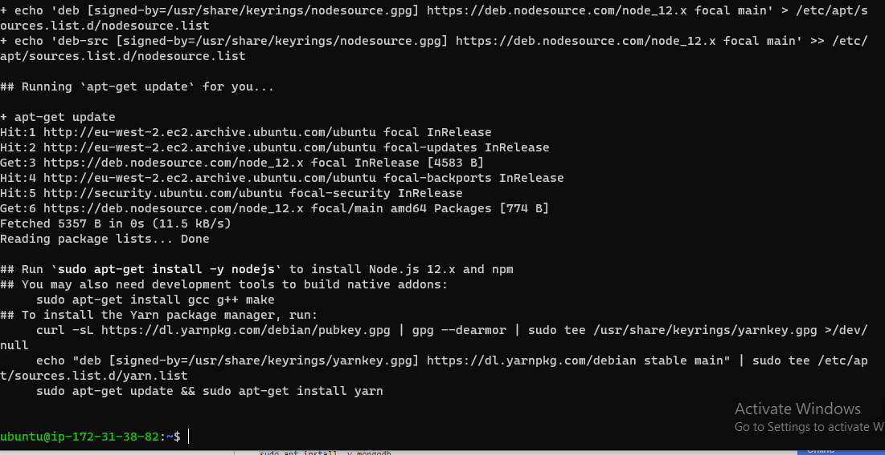
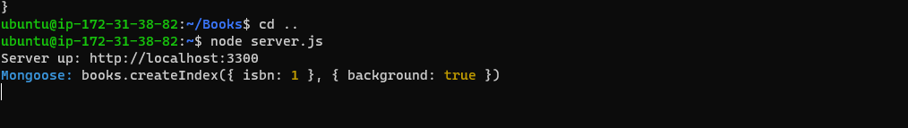

#Step 1: Install NodeJs

`sudo apt update`

`sudo apt upgrade`

`sudo apt-y`

`curl-sl`

`sudo apt install-y nodejs`

#Step 2: Install MongoDB

`sudo-apt-install-y-mongodb`

`sudo apt install-y npm`

`sudo npm install body-parser`

#Step 3: Install Express and set up routes to the server

`sudo npm install express mongoose`

`mkdir models && cd models`

#Step 4 – Access the routes with AngularJS

`public folder`

`node server.js`

`curl-s`

`web page`

